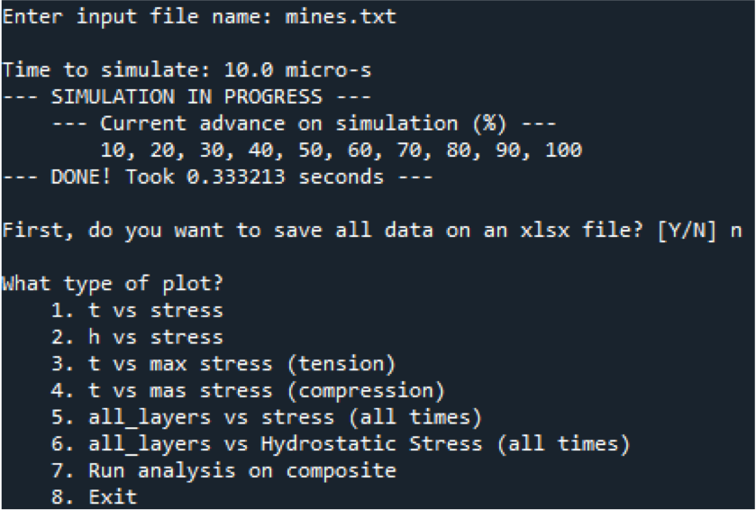
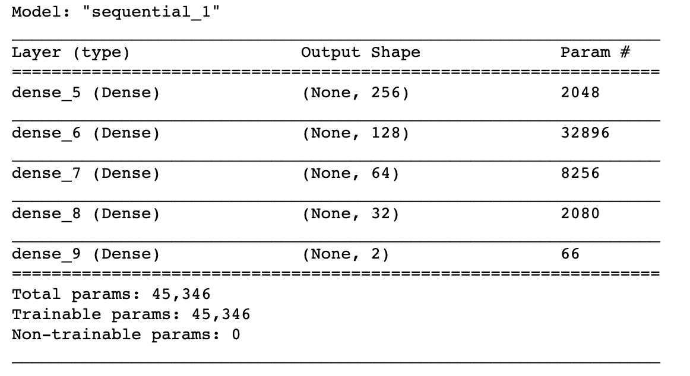
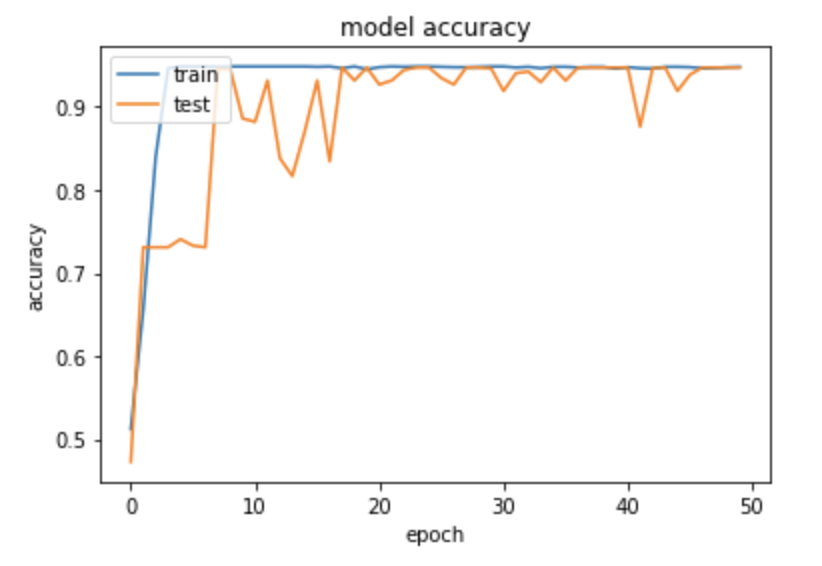

## Armours analysis using Python and Deep Learning models

### PHASE 1: Stress wave propagation model definition
A general model was defined in order to simulate the behavior of any composite, with any interface interactions between the layers and no simplifications needed for the physical or mechanical properties. This model was intended to be as accurate as the theoretical description of it. In general, the considerations for the stress wave propagation are as follows:
*	The stress waves are considered purely elastic for all the layers.
*	The propagation of the stress waves, incident and transmitted stresses, is due totally to the change on the impedance of each of the layers’ interfaces.
*	The projectile is assumed to remain still after it impacts the composite.
*	For every layer (material), the following properties are needed:
 *	Thickness
 *	Young’s Modulus
 *	Density
 *	Mass
 *	Poisson’s ration
*	The impact is considered to happen locally on a given portion of the surface, then the stress propagation occurs for each of the layers in local confinement. 
### PHASE 2: Computational modeling of stress wave propagation
The model previously described was developed and coded in Python (under models directory). The Object-Oriented Programming (OOP) paradigm was used given the nature of the stress waves and layers to behave independently and with certain specific physical logic. The code was mainly decoupled into two major sections:
* Model: The model itself, developed and considering two different classes of objects, Layer and Wave.
* Controller: The code aimed to control the input files, create the needed layers and initial conditions, simulate the stress waves for the specified time and show the results back as plots and graphics.
Both sections were coded to work together and complimentary as the base code for the complete modeling of the stress wave propagation for further analysis and parameters to satisfy the main objective of an engineering design tool.
#### Model
The model developed, as stated, was composed by two main classes: Wave and Layer. Each of these classes handles all the physical and mechanical logic of stress waves and layers of the main composite, respectively. The model also provides the main simulation function that allows the waves to propagate through all layers, given the initial conditions such as impact velocity of projectile, initial stress waves at region of impact and simulation time (including time step). The details and main considerations for each of the classes and the main simulation as detailed next.
* Wave class: The wave object was defined holding the next characteristics:
    * Position (inside the layer, in nodes)
    *	Size (total width it can travel, in nodes)
    *	Direction (positive or negative direction)
    *	Value (stress value it carries)

* Layer class: The layer class was defined holding the next characteristics:
    *	Thickness (in mm)
    *	Young’s Modulus (in Pa)
    *	Density (in kg/m3)
    *	Impedance (in kg/m2s)
    *	Mass (in kg)
    *	Poisson’s ratio
    *	Failure stress (compression, tension or both, in Pa). If one is given, both are considered the same. If none are given, they are considered as missing.
    *	Wave’s list (all waves belonging to this layer)
    *	Relevance (either relevant or not for the designer). If not specified, it is considered relevant by default.
Additionally, the layer class also defines an “hval” function that returns a linear space from x = 0 up to x = thickness, this function will be used in post-processing to reproduce the plots for results. Finally, and as will be explained on next sections, the class defines an “hydStress” function that returns the hydrostatic stress mesh (same dimension as original stress mesh) given the local confinement of the region of propagation.
* Simulate function: Once the classes were defined, the model carries the “simulate_waves” function that performs the simulation for the composite and initial parameters defined. The code considers all the initial conditions for the simulation and starts the following steps, executing one-time step at a time until it reaches the final simulation time.
The code traverses every layer, one at a time, up to the total simulation time
    1.	For a given layer, it starts copying the previous stress state for new time step. In general, all nodes remain unchanged except for the ones that are located on the position of the waves
    2.	Then, the code traverses all the existent waves on the current layer
        1. Propagates the wave given its direction and its value, changing the needed nodes (considering tension or compression)
        2. If the wave is located at the interface with another layer, a new wave should be created. In this step, given the direction of the wave and the layer it collides with, the new wave is created using the transmitted stress function. Then, this wave’s value is changed by the respective reflected stress.
        3. After all waves are propagated and updated, the code merges waves at same location with same direction created on the previous time step (if possible) in order to diminish the total execution time per loop and the total running time as well.
*Note*: The model can keep track of the current state of the simulation in terms of completion percentage. 

The previous pseudo-code explanation has the actual code stated in the wave_prop_analysis_V2 file (under models). A benchmark was carried out between both versions on three different composites (configuration not relevant) and the results are shown next, where running time is the simulation time and the values are the execution times the code performed on every version, all in seconds.

#### Controller
The controller, in programming terms, is the entity responsible of making the model work with the user defined inputs and the visual entities (if any). In this context, two main controllers were defined in order to simulate the stress wave propagations: one controller for a single composite and one controller for multiple composites (for comparison purposes).
##### Single composite
Carry out an analysis for a single composite is the core idea of the present work. The code not only provides graphical results for the composites, but it also performs an automated analysis and gives back the results stating if the composite is promising and satisfies the mechanical expected behavior for the current conditions, or if the composite is not promising and what are the layers that are not enough from a mechanical perspective. The menu the code allows is presented as follows.

As it can be seen, the first option available, before the core analysis options, is the ability to store the results (stress mesh of each of the layers) into an Excel file (.xlsx). This allows further post-processing on different tools or programs such as Excel itself, data science environments or databases exports. After this main option, 8 different options are considered and explained as follows.

* T VS STRESS: This allows the user to plot a time-stress graph for any of the layers of the composite.
 
* H VS STRESS: This allows the user to plot a thickness-stress graph for any of the layers of the composite.
 
* T VS MAX STRESS (TENSION): This allows the user to plot a thickness-stress graph, where the stresses to plot are the max tension stresses for each time on any point of the layer, for any of the layers of the composite.

* T VS MAX STRESS (COMPRESSION): This allows the user to plot a thickness-stress graph, where the stresses to plot are the max compression stresses for each time on any point of the layer, for any of the layers of the composite.

* ALL LAYERS VS STRESS (ALL TIMES): This allows the user to plot a width-stress graph, where the width is the total width of the composite, all layers together, allowing to see the silhouette of the main behavior of the stress waves.

* ALL LAYERS VS HYDROSTATIC STRESS (ALL TIMES): This allows the user to plot a width-stress graph, where the width is the total width of the composite, and the hydrostatic stress is considered given its local confinement, allowing to see the silhouette of the main behavior of the stress waves.

* RUN ANALYSIS ON COMPOSITE: This allows the user to run a fully automated analysis on the composite, in order to determine if the composite does satisfy or does not the conditions to be considered as a valid armour regarding the stress waves on it.

* EXIT: This allows the user to correctly exit the simulation in progress. This option does consider any kind of persistence of the state of the simulation, all the results are removed from memory unless the user manually store the figures and plots.

##### Multiple composites
Rather than just simulating one single composite and analyzing it in depth, the designer should be able to compare the behavior for multiple composites as another tool for the design, in this case the ability to choose the composite with best mechanical behavior.

#### Input file format
The code developed is intended to be decoupled in terms of the model, the controller and the input files/configurations of the composites. As shown before, both model and controllers are independent from each other and they perform the specific tasks needed on each entity. Now, regarding the input configurations, and making the input the most user-friendly (avoiding unnecessary duplicate inputs for different simulations), a text format was defined, and a sample format is presented in *data*. Inside the file, any line that starts with the character <#> is considered as a comment and the code will not parse it as part of the input. The format is composed mainly by three sections:
*	Layers of the composite: The first line of the format shall specify the number of layers to consider. Considering this number as N, the file then reads the next N lines to consider all layers of the composite, one per line, with their respective physical and mechanical properties. As stated before, some properties are optional, and the code would consider default values for them in case they are not written.
*	Simulation time: After the layers, the file expects the parameters for the simulation time to use, either by the simulation time and time step (optional) or by the number of reverberations to consider. In the latter case, the code will determine the simulation time to complete the reverberations requested.
*	Initial conditions (waves): Finally, the format specifies the initial conditions of the stress, either by the impact velocity and the layer where it applies, or directly the stress value and the layer. Both conditions are valid and can appear simultaneously for different layers.
For further details and how this format works, the data refers to the sample TXT file and it contains, as comments, all the explanation on the inputs needed, their units and their possible values. It clearly states the mandatory inputs and the optional parameters. It is worth noting that, if a layer is considered as relevant and its failure stresses are not declared (these are option), the code will through a warning and the automated analysis cannot be carried out.

### PHASE 3: Machine learning techniques to predict behavior and response
The whole process and simulation described in Phase 2 is the main core analysis of the present work and all its development led to the idea of faster techniques to allow faster iterations on different models. One idea of a faster approach is to use the new state of the art in terms of artificial intelligence and machine learning. Classic machine learning ideas are often used for regression and classification problems, supervised or unsupervised. For the present work, it was considered a deep learning model with a final task of binary classification.
As any machine learning model, it relies on training, test and validation dataset in order to understand and model the behaviors expected. These datasets were developed with the aid of the data_generator file under *models*.
Once the datasets are generated, the code imports them into the DL environment using the Pandas library. If only few of the characteristics of the composites change and some of them remain still for all configurations, the DL model discards these features in order to reduce the bias in the input datasets which are not meaningful for the learning process. The next step is to normalize the inputs due to the different scales for every parameter. This architecture considers the following hyperparameters (external parameters for the model, can be tuned for different training datatsets):
* Optimizer: Adam optimization algorithm with learning rate of 0.003
* Loss function: Sparse categorical cross-entropy
* Epochs (passes through dataset): 20
*	Batch size: 32
The model considers a training dataset of 80% and a validation dataset of 20%. For larger datasets (> 1 million), these percentages are not the most accurate and it can be considered 95% for training, 2.5% for validation and 2.5% for final testing.

This new approach proposed is complimentary to the main model developed and it is not a standalone program by itself. It needs the logic of the core model to generate datasets, label the responses and, finally, classify new models into two categories: “good configuration” and “bad configuration”. However, the discard choices are completely on the designer’s side and the core model can be used to get more in-depth conclusions about the final labels predicted by the DL model.

#### Baseline DL training
The baseline model was trained on a sample dataset of 1782 configurations and the following DL architecture. 

Once the DL model was completely trained with 80% of the input data, for 20 epochs and batch sizes of 32, the accuracy in the training dataset was 90.81% (expected to be high as there training dataset is not very large) and the accuracy in the validation dataset was 93.26%. The next figure shows the history of the accuracy along the epochs defined. 

This accuracy is considerably high for the simplicity of the DL model and it leads to the idea of a well-tuned model that can be improved if a more complex Neural Network structure is considered and the input dataset has at least 50,000 configurations with more features changing in between them. Nevertheless, these results are a great baseline limit and the model predicts very accurate the response on unseen configurations. As mentioned before, this model can simplify the process of discarding configurations, letting the user/designer to focus on composites that are more prone to be reliable armour configurations. The next step then is to pass these “good” composites through the core analysis described in Phase 2.
